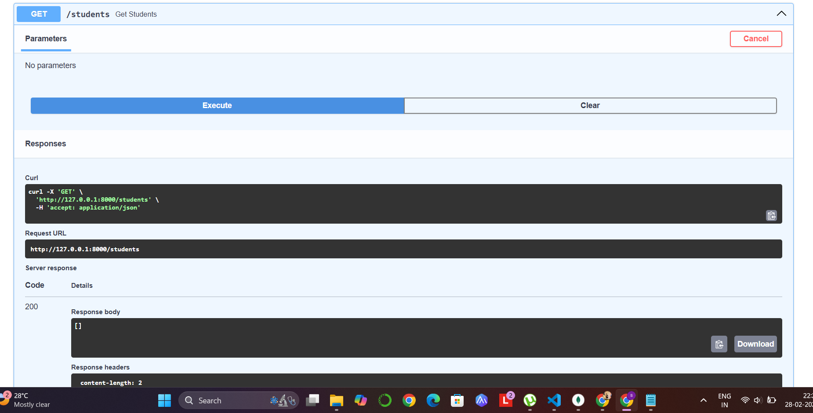
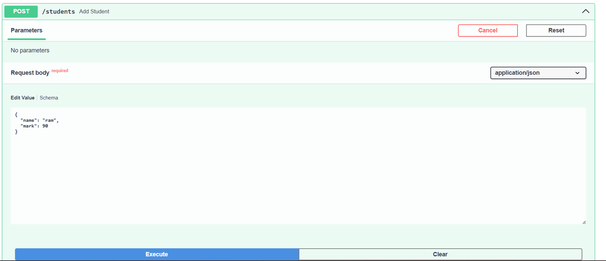
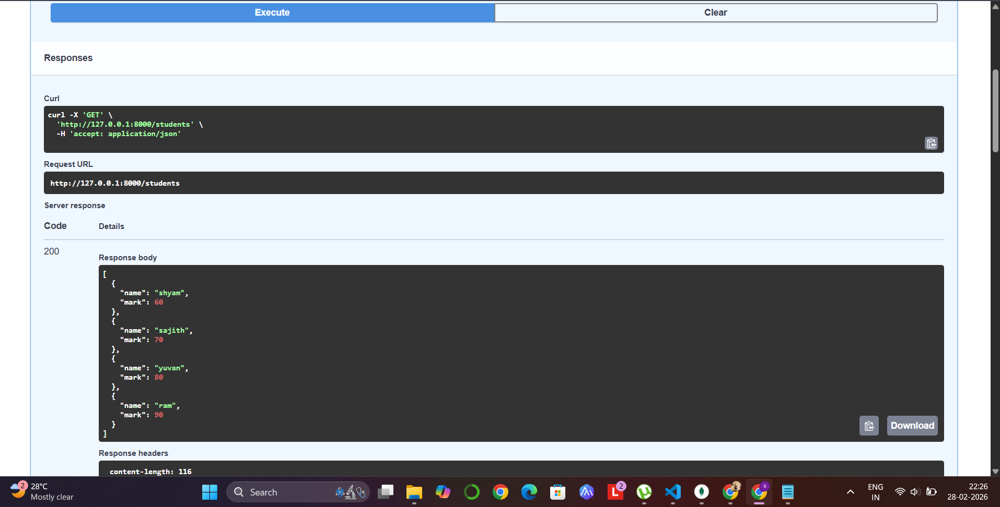
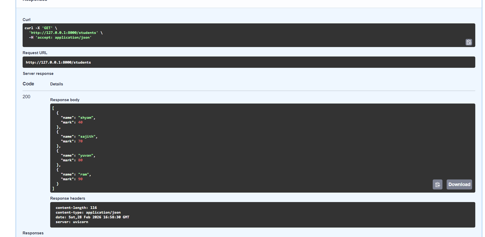
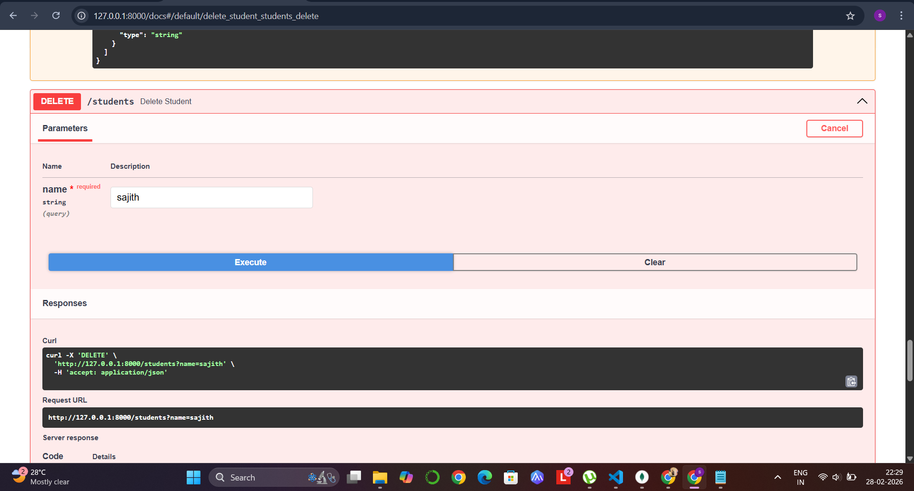
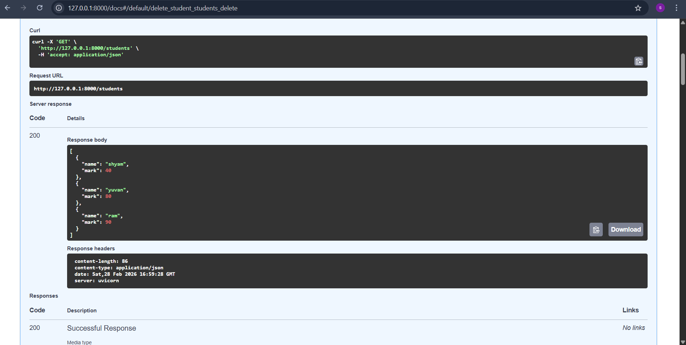

# 📊 Student Mark Analyzer API
## FastAPI + MongoDB Implementation
## 🚀 Project Overview

This project is a Student Mark Analyzer application that was successfully converted from a simple Python-based program into a fully functional REST API using FastAPI and MongoDB.

## The API performs complete CRUD operations:

✅ Create student records

✅ Read student records

✅ Update student marks

✅ Delete student records

This project demonstrates backend development concepts including API design, database integration, modular structure, and Swagger documentation.

## 🛠️ Technologies Used

🐍 Python

⚡ FastAPI

🍃 MongoDB (localhost:27017)

🔄 REST API (GET, POST, PUT, DELETE)

📘 Swagger UI (/docs)

🔐 python-dotenv

## 📁 Project Structure
```
student-mark-analyzer/
│
├── main.py                # FastAPI application & API routes
├── config.py              # MongoDB connection setup
├── marks_analyzer.py      # Business logic functions
├── requirements_api.txt   # API-specific dependencies
├── requirements.txt       # General project dependencies
├── .env                   # Environment variables
├── .gitignore             # Git ignored files
└── README.md              # Project documentation
```

## 🔄 Conversion to FastAPI

The original Python logic was modularized and converted into an API-based architecture:

Separated business logic into marks_analyzer.py

Added database configuration in config.py

Created REST endpoints in main.py

Connected MongoDB using environment variables

Enabled auto-generated API documentation using Swagger

## ⚙️ How to Run the Project
1️⃣ Install Dependencies
pip install -r requirements_api.txt
2️⃣ Start FastAPI Server
uvicorn main:app --reload
3️⃣ Open Swagger UI

Open in browser:

http://127.0.0.1:8000/docs
🗄️ MongoDB Configuration

Make sure MongoDB is running locally:

mongodb://localhost:27017

The application connects to MongoDB and stores student records dynamically.

🧪 API Testing Demonstration (Step-by-Step)

All operations are performed using Swagger UI:

http://127.0.0.1:8000/docs
✅ Step 1: Initial GET Request

Open /docs

Click GET

Click Try it out

Click Execute

🔎 Output:
[]


✅ Step 2: Add Students (POST)

Click POST → Try it out

Add students one by one:

{
  "name": "shyam",
  "mark": 60
}
{
  "name": "sajith",
  "mark": 70
}
{
  "name": "yuvan",
  "mark": 80
}
{
  "name": "ram",
  "mark": 90
}




✅ Step 3: GET After Insertion

Click GET → Execute

🔎 Output:
[
  {"name": "shyam", "mark": 60},
  {"name": "sajith", "mark": 70},
  {"name": "yuvan", "mark": 80},
  {"name": "ram", "mark": 90}
]



✅ Step 4: Update Student Mark (PUT)

Click PUT → Try it out

Update Shyam's mark to 40:

{
  "name": "shyam",
  "mark": 40
}

Click Execute

Now perform GET again.

🔎 Updated Output:
{
  "name": "shyam",
  "mark": 40
}


---

✅ Step 5: Delete Student (DELETE)

Click DELETE → Try it out

Delete student:

name = sajith

Click Execute

Now perform GET again.

🔎 Final Output:
[
  {"name": "shyam", "mark": 40},
  {"name": "yuvan", "mark": 80},
  {"name": "ram", "mark": 90}
]

Sajith has been successfully removed from the database.


---


📌 API Endpoints Summary
Method	Endpoint	Description
GET	/students	Retrieve all students
POST	/students	Add new student
PUT	/students	Update student mark
DELETE	/students/{name}	Delete student
🎯 Learning Outcomes

Through this project, I learned:

Converting a traditional Python application into a REST API

Implementing CRUD operations in FastAPI

Integrating MongoDB with FastAPI

Structuring backend applications in a modular way

Using Swagger UI for API documentation and testing

👨‍💻 Author

Developed as part of internship training to demonstrate backend API development skills using FastAPI and MongoDB.